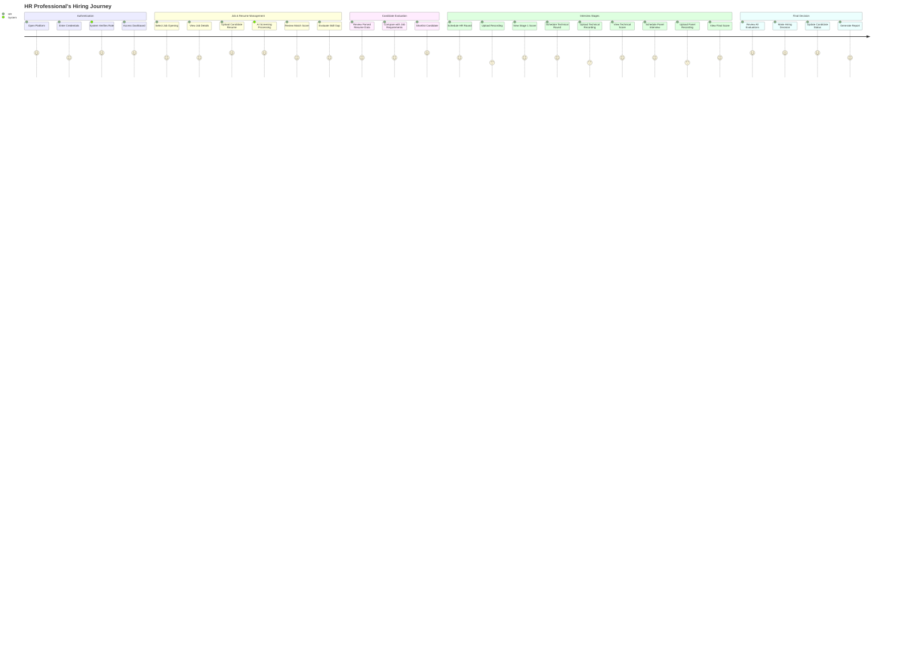

# Application / Website Architecture

## Application Workflow

The Hiring Platform operates through a structured, multi-stage workflow that connects the React frontend with the FastAPI backend to deliver an AI-powered recruitment experience.

```
┌─────────────────────────────────────────────────────────────────────────────┐
│                           APPLICATION WORKFLOW                               │
├─────────────────────────────────────────────────────────────────────────────┤
│                                                                              │
│  ┌─────────────┐     ┌─────────────┐     ┌─────────────┐     ┌─────────────┐ │
│  │             │     │             │     │             │     │             │ │
│  │  1. AUTH    │────▶│  2. JOBS    │────▶│  3. RESUME │────▶│  4. SCREEN │ │
│  │             │     │             │     │             │     │             │ │
│  │  Login &    │     │  Create &   │     │  Upload &   │     │  AI Match   │ │
│  │  RBAC       │     │  Manage     │     │  Parse      │     │  Analysis   │ │
│  │             │     │             │     │             │     │             │ │
│  └─────────────┘     └─────────────┘     └─────────────┘     └─────────────┘ │
│                                                                    │        │
│                                                                    ▼        │
│  ┌─────────────┐     ┌─────────────┐     ┌─────────────┐     ┌─────────────┐ │
│  │             │     │             │     │             │     │             │ │
│  │  6. FINAL   │◀────│  5. EVAL   │◀────│  4. STAGES │◀────│  PROGRESS  │ │
│  │             │     │             │     │             │     │             │ │
│  │  Hire/Reject│     │  Interview  │     │  HR/Tech/   │     │  Candidate  │ │
│  │  Decision   │     │  Scores     │     │  Panel      │     │  Pipeline  │ │
│  │             │     │             │     │             │     │             │ │
│  └─────────────┘     └─────────────┘     └─────────────┘     └─────────────┘ │
│                                                                              │
└─────────────────────────────────────────────────────────────────────────────┘
```

### Workflow Steps

#### 1. Authentication & Authorization

```
┌──────────────┐      ┌──────────────┐      ┌──────────────┐      ┌──────────────┐
│              │      │              │      │              │      │              │
│  User opens  │─────▶│  Login form   │─────▶│  Validate    │─────▶│  JWT token   │
│  Platform    │      │  submitted    │      │  credentials │      │  issued      │
│              │      │              │      │              │      │              │
└──────────────┘      └──────────────┘      └──────────────┘      └──────────────┘
                                                                    │
         ┌──────────────────────────────────────────────────────────┘
         │
         ▼
┌──────────────┐      ┌──────────────┐      ┌──────────────┐
│              │      │              │      │              │
│  Role-based  │─────▶│  Permission  │─────▶│  Access      │
│  routing     │      │  check       │      │  granted     │
│              │      │              │      │              │
└──────────────┘      └──────────────┘      └──────────────┘
```

**Process Details**:
1. User submits login credentials via React frontend
2. FastAPI backend validates against PostgreSQL user store
3. BCrypt hash comparison for password verification
4. JWT token generated with user ID, roles, and permissions
5. Token returned to frontend and stored in Redux
6. Subsequent requests include JWT in Authorization header
7. Backend middleware validates token and checks permissions

#### 2. Job & Candidate Management

```
┌──────────────┐      ┌──────────────┐      ┌──────────────┐
│              │      │              │      │              │
│  Admin/HR    │─────▶│  Create Job  │─────▶│  Store in    │
│  creates job │      │  with JD     │      │  PostgreSQL  │
│              │      │              │      │              │
└──────────────┘      └──────────────┘      └──────────────┘
                                                    │
         ┌──────────────────────────────────────────┘
         │
         ▼
┌──────────────┐      ┌──────────────┐      ┌──────────────┐
│              │      │              │      │              │
│  Configure   │─────▶│  Define      │─────▶│  Setup       │
│  stages      │      │  required    │      │  interview   │
│              │      │  skills      │      │  pipeline    │
└──────────────┘      └──────────────┘      └──────────────┘
```

**Process Details**:
1. Admin creates job posting with title, description, and location
2. Job Description (JD) stored as text and JSONB
3. Required skills associated with job via job_skills table
4. Interview stage template applied to job
5. Job activation status managed (is_active flag)
6. Audit log entry created for compliance

#### 3. Resume Upload & AI Pre-Filter

```
┌─────────────────────────────────────────────────────────────────────────────┐
│                        RESUME PROCESSING PIPELINE                             │
├─────────────────────────────────────────────────────────────────────────────┤
│                                                                              │
│  ┌─────────┐    ┌─────────┐    ┌─────────┐    ┌─────────┐    ┌─────────┐    │
│  │ Upload │───▶│ Parse   │───▶│ Extract │───▶│ Embed   │───▶│ Match   │    │
│  │ File   │    │ Text    │    │ Info    │    │ Vectors │    │ Score   │    │
│  └─────────┘    └─────────┘    └─────────┘    └─────────┘    └─────────┘    │
│       │             │             │             │               │         │
│       ▼             ▼             ▼             ▼               ▼         │
│  ┌─────────┐    ┌─────────┐    ┌─────────┐    ┌─────────┐    ┌─────────┐    │
│  │  PDF/   │    │ pymupdf │    │ Ollama  │    │ Sentence│    │ pgvector│    │
│  │  DOCX  │    │ docx2txt│    │ LLM     │    │Transform│    │ cosine  │    │
│  └─────────┘    └─────────┘    └─────────┘    └─────────┘    └─────────┘    │
│                                                                              │
└─────────────────────────────────────────────────────────────────────────────┘
```

**Process Details**:

1. **File Upload** (`POST /api/v1/jobs/{job_id}/resume`)
   - HR selects PDF or DOCX file from frontend
   - File validated for type, size, and extension
   - File saved to disk storage

2. **Text Extraction**
   - PDF parsed using `pymupdf` (PyMuPDF)
   - DOCX parsed using `docx2txt`
   - Raw text extracted for LLM processing

3. **LLM Information Extraction**
   - Raw text sent to Ollama LLM
   - DSPy-optimized prompts extract structured data:
     - Name, email, phone
     - Skills and experience
     - Education details
   - Extracted data normalized and stored

4. **Semantic Embedding Generation**
   - Candidate profile embedded using Sentence Transformers
   - Job Description embedded separately
   - Embeddings stored in PostgreSQL via pgvector

5. **Job Matching Analysis**
   - Cosine similarity calculated between embeddings
   - Ollama LLM performs detailed match analysis
   - Pass/Fail decision based on configurable threshold (default: 0.65)
   - Skill gap analysis generated

6. **Results Storage**
   - Analysis results stored as JSONB in resume record
   - RRF score calculated for candidate ranking
   - Candidate status updated in pipeline

#### 4. Interview Stages Processing

```
┌─────────────────────────────────────────────────────────────────────────────┐
│                        INTERVIEW STAGE PIPELINE                               │
├─────────────────────────────────────────────────────────────────────────────┤
│                                                                              │
│     Stage 1              Stage 2              Stage 3              Stage N   │
│  ┌──────────┐        ┌──────────┐        ┌──────────┐        ┌──────────┐   │
│  │  HR     │───────▶│ Technical│───────▶│  Panel   │───────▶│  Final   │   │
│  │  Round  │        │ Practical│        │ Evaluation│       │  Review  │   │
│  └──────────┘        └──────────┘        └──────────┘        └──────────┘   │
│       │                   │                   │                                │
│       ▼                   ▼                   ▼                                │
│  ┌──────────┐        ┌──────────┐        ┌──────────┐        ┌──────────┐   │
│  │Recording │        │Recording │        │Recording │        │Recording │   │
│  │Upload    │        │Upload    │        │Upload    │        │Upload    │   │
│  └──────────┘        └──────────┘        └──────────┘        └──────────┘   │
│       │                   │                   │                                │
│       ▼                   ▼                   ▼                                │
│  ┌──────────────────────────────────────────────────────────────────────┐   │
│  │                      AI EVALUATION LAYER                              │   │
│  │                                                                       │   │
│  │   ┌─────────────┐    ┌─────────────┐    ┌─────────────────────────┐  │   │
│  │   │  Transcript │───▶│   DSPy     │───▶│   Technical/Behavioral  │  │   │
│  │   │  Generation │    │  Evaluator  │    │   Score Calculation     │  │   │
│  │   └─────────────┘    └─────────────┘    └─────────────────────────┘  │   │
│  │                                                                       │   │
│  └──────────────────────────────────────────────────────────────────────┘   │
│                                                                              │
└─────────────────────────────────────────────────────────────────────────────┘
```

**Process Details**:
1. Candidate progresses through configured interview stages
2. Each stage may include recording uploads (audio/video)
3. Transcripts generated from recordings
4. LLM-as-a-Judge evaluates using DSPy-optimized prompts
5. Technical and behavioral scores calculated
6. HR decisions recorded at each stage
7. Cumulative scores tracked across pipeline

#### 5. AI Evaluation

The platform uses multiple AI components for intelligent evaluation:

```
┌─────────────────────────────────────────────────────────────────────────────┐
│                           AI EVALUATION ENGINE                               │
├─────────────────────────────────────────────────────────────────────────────┤
│                                                                              │
│  ┌─────────────────────────┐    ┌─────────────────────────┐                │
│  │     RESUME PARSER       │    │    JOB MATCH ANALYZER    │                │
│  │                         │    │                         │                │
│  │  Input: Raw PDF/DOCX    │    │  Input: Candidate + JD   │                │
│  │  Output: Structured JSON │    │  Output: Match Score     │                │
│  │                         │    │                         │                │
│  │  ┌─────────────────┐    │    │  ┌─────────────────┐   │                │
│  │  │   Ollama LLM   │    │    │  │   Ollama LLM    │   │                │
│  │  │  (Extraction)  │    │    │  │  (Analysis)     │   │                │
│  │  └─────────────────┘    │    │  └─────────────────┘   │                │
│  │         │              │    │         │              │                │
│  │         ▼              │    │         ▼              │                │
│  │  ┌─────────────────┐   │    │  ┌─────────────────┐   │                │
│  │  │ DSPy Optimized  │   │    │  │ Semantic Score │   │                │
│  │  │    Prompts      │   │    │  │    + LLM        │   │                │
│  │  └─────────────────┘   │    │  └─────────────────┘   │                │
│  │                         │    │                         │                │
│  └─────────────────────────┘    └─────────────────────────┘                │
│                                                                              │
│  ┌─────────────────────────┐    ┌─────────────────────────┐                │
│  │   EMBEDDING SERVICE      │    │   INTERVIEW EVALUATOR   │                │
│  │                         │    │                         │                │
│  │  Model: all-MiniLM-L6-v2│    │  Input: Transcripts     │                │
│  │  Storage: pgvector      │    │  Output: Stage Scores    │                │
│  │  Similarity: Cosine     │    │                         │                │
│  │                         │    │  ┌─────────────────┐    │                │
│  │  ┌─────────────────┐    │    │  │   DSPy LLM-as-  │    │                │
│  │  │ Sentence        │    │    │  │   a-Judge       │    │                │
│  │  │ Transformers    │    │    │  │   Evaluation    │    │                │
│  │  └─────────────────┘    │    │  └─────────────────┘    │                │
│  │                         │    │                         │                │
│  └─────────────────────────┘    └─────────────────────────┘                │
│                                                                              │
└─────────────────────────────────────────────────────────────────────────────┘
```

#### 6. Result Visualization & Analytics

```
┌─────────────────────────────────────────────────────────────────────────────┐
│                          ANALYTICS DASHBOARD                                 │
├─────────────────────────────────────────────────────────────────────────────┤
│                                                                              │
│   ┌─────────────────┐  ┌─────────────────┐  ┌─────────────────┐            │
│   │   JOBS          │  │   CANDIDATES     │  │   PIPELINE      │            │
│   │   Active: 12    │  │   Total: 847     │  │   Stage 1: 156  │            │
│   │   New: 3        │  │   Pending: 89    │  │   Stage 2: 45   │            │
│   └─────────────────┘  └─────────────────┘  └─────────────────┘            │
│                                                                              │
│   ┌─────────────────────────────────────────────────────────────────────┐   │
│   │                         CONVERSION FUNNEL                            │   │
│   │                                                                       │   │
│   │   Applied ──────▶ Screened ──────▶ Interviewed ──────▶ Hired        │   │
│   │     847            234               67                 12             │   │
│   │   (100%)          (27.6%)          (7.9%)            (1.4%)          │   │
│   │                                                                       │   │
│   └─────────────────────────────────────────────────────────────────────┘   │
│                                                                              │
│   ┌─────────────────────────────────────────────────────────────────────┐   │
│   │                       SKILL DEMAND ANALYSIS                           │   │
│   │                                                                       │   │
│   │   Python ████████████████████░░░░░ 75%                              │   │
│   │   React  █████████████████░░░░░░░░░ 60%                              │   │
│   │   SQL    ████████████████░░░░░░░░░░ 55%                             │   │
│   │   AWS    █████████████░░░░░░░░░░░░░ 45%                              │   │
│   │                                                                       │   │
│   └─────────────────────────────────────────────────────────────────────┘   │
│                                                                              │
└─────────────────────────────────────────────────────────────────────────────┘
```

---

## User Journey Diagram



### Actor-Specific Journeys

#### Admin Journey
```
┌─────────────────────────────────────────────────────────────────────────────┐
│                              ADMIN USER JOURNEY                              │
├─────────────────────────────────────────────────────────────────────────────┤
│                                                                              │
│  1. System Setup                                                            │
│     ├── Configure roles and permissions                                     │
│     ├── Create stage templates                                              │
│     └── Set up system parameters                                            │
│                                                                              │
│  2. User Management                                                         │
│     ├── Invite team members                                                 │
│     ├── Assign roles and permissions                                        │
│     └── Manage user accounts                                                │
│                                                                              │
│  3. Monitoring                                                               │
│     ├── Review audit logs                                                   │
│     ├── Monitor analytics dashboard                                         │
│     └── Generate hiring reports                                             │
│                                                                              │
└─────────────────────────────────────────────────────────────────────────────┘
```

#### Recruiter Journey
```
┌─────────────────────────────────────────────────────────────────────────────┐
│                            RECRUITER USER JOURNEY                            │
├─────────────────────────────────────────────────────────────────────────────┤
│                                                                              │
│  1. Job Preparation                                                          │
│     ├── View assigned jobs                                                   │
│     ├── Review job requirements                                              │
│     └── Prepare candidate materials                                         │
│                                                                              │
│  2. Resume Processing                                                        │
│     ├── Upload resumes for jobs                                             │
│     ├── Monitor screening results                                           │
│     └── Track candidate progress                                            │
│                                                                              │
│  3. Interview Coordination                                                   │
│     ├── Schedule interviews                                                  │
│     ├── Upload interview recordings                                         │
│     └── Collect evaluation scores                                            │
│                                                                              │
└─────────────────────────────────────────────────────────────────────────────┘
```

---

## Technology Stack and Framework

### Architecture Overview

```
┌─────────────────────────────────────────────────────────────────────────────┐
│                              TECHNOLOGY STACK                                │
├─────────────────────────────────────────────────────────────────────────────┤
│                                                                              │
│                           ┌─────────────────────┐                           │
│                           │                     │                           │
│                           │    FRONTEND         │                           │
│                           │    (Client)         │                           │
│                           │                     │                           │
│                           │  React 19 + Vite    │                           │
│                           │  TypeScript         │                           │
│                           │                     │                           │
│                           └──────────┬──────────┘                           │
│                                      │                                       │
│                                      │ REST API                              │
│                                      │                                       │
│                           ┌──────────┴──────────┐                           │
│                           │                     │                           │
│                           │    BACKEND          │                           │
│                           │    (Server)         │                           │
│                           │                     │                           │
│                           │  FastAPI + Python   │                           │
│                           │  SQLAlchemy         │                           │
│                           │                     │                           │
│                           └──────────┬──────────┘                           │
│                                      │                                       │
│           ┌──────────────────────────┼──────────────────────────┐           │
│           │                          │                          │           │
│           ▼                          ▼                          ▼           │
│  ┌─────────────────┐      ┌─────────────────┐      ┌─────────────────┐       │
│  │                 │      │                 │      │                 │       │
│  │   POSTGRESQL    │      │     REDIS       │      │    OLLAMA       │       │
│  │   + pgvector    │      │                 │      │                 │       │
│  │                 │      │                 │      │                 │       │
│  │  Data Storage   │      │   Cache Layer   │      │   LLM Engine    │       │
│  │  Vector Search  │      │   Session Mgmt  │      │   Local AI      │       │
│  │                 │      │                 │      │                 │       │
│  └─────────────────┘      └─────────────────┘      └─────────────────┘       │
│                                                                              │
└─────────────────────────────────────────────────────────────────────────────┘
```

### Frontend Technologies

| Component | Technology | Version | Purpose |
|-----------|------------|---------|---------|
| **Framework** | React | 19.x | UI library with hooks |
| **Build Tool** | Vite | 8.x | Fast development server and bundler |
| **Language** | TypeScript | 5.x | Type-safe JavaScript |
| **Routing** | React Router | v7 | Client-side navigation |
| **State Management** | Redux Toolkit | 2.x | Centralized state |
| **UI Framework** | React Bootstrap | 5.3 | Responsive components |
| **Forms** | React Hook Form | 7.x | Form handling |
| **Validation** | Zod | 3.x | Schema validation |
| **HTTP Client** | Axios | 1.x | API communication |

#### Frontend Directory Structure

```
frontend/src/
├── apis/                    # API clients
│   ├── client.ts           # Axios instance configuration
│   ├── services/           # Service modules
│   │   ├── auth.ts
│   │   ├── job.ts
│   │   └── resume.ts
│   ├── admin/              # Admin API client
│   └── types/              # TypeScript types
├── components/             # React components
│   ├── auth/               # Authentication components
│   ├── candidate/          # Candidate-related components
│   ├── common/             # Shared UI components
│   └── modal/              # Modal dialogs
├── hooks/                  # Custom React hooks
├── pages/                  # Page components
│   ├── Admin/              # Admin dashboard pages
│   ├── Home/               # Home page
│   ├── JobCandidates/      # Job and candidate pages
│   └── Login/              # Login page
├── routes/                 # Route configuration
├── schemas/                # Zod validation schemas
├── store/                  # Redux store
│   ├── slices/             # Redux slices
│   │   └── authSlice.ts
│   └── hooks.ts            # Typed hooks
└── utils/                  # Utility functions
```

### Backend Technologies

| Component | Technology | Version | Purpose |
|-----------|------------|---------|---------|
| **Framework** | FastAPI | 0.109+ | Async web framework |
| **Language** | Python | 3.14+ | Backend language |
| **ORM** | SQLAlchemy | 2.x | Database abstraction |
| **CRUD Operations** | FastCRUD | 1.x | Rapid CRUD generation |
| **Validation** | Pydantic | V2 | Data validation |
| **Database** | PostgreSQL | 16+ | Primary database |
| **Vector Extension** | pgvector | 0.7+ | Vector similarity search |
| **Cache** | Redis | 7+ | Caching layer |
| **AI - Embeddings** | Sentence Transformers | 2.x | Semantic embeddings |
| **AI - LLM** | Ollama | latest | Local LLM inference |
| **AI - Optimization** | DSPy | latest | Prompt optimization |
| **Document Parsing** | pymupdf | 1.x | PDF text extraction |
| **Document Parsing** | docx2txt | 0.4 | DOCX text extraction |
| **Security** | python-jose | 3.x | JWT handling |
| **Security** | passlib | 1.7 | Password hashing (BCrypt) |
| **Testing** | pytest | 8.x | Testing framework |
| **Testing** | pytest-asyncio | 0.23+ | Async test support |

#### Backend Directory Structure

```
backend/app/
├── main.py                 # Application entry point
├── v1/
│   ├── api/
│   │   └── main.py         # API router aggregation
│   ├── core/               # Core functionality
│   │   ├── analyzer.py     # Resume JD analyzer
│   │   ├── cache.py        # Redis cache
│   │   ├── config.py       # Configuration
│   │   ├── embeddings/     # Embedding service
│   │   ├── extractor.py    # Document parser
│   │   ├── logging.py      # Logging setup
│   │   ├── middleware.py   # Custom middleware
│   │   ├── resume_executor.py # Thread pool executor
│   │   └── security.py      # Security utilities
│   ├── db/
│   │   ├── base.py         # SQLAlchemy base
│   │   ├── base_class.py   # Base model class
│   │   ├── models/         # ORM models
│   │   └── session.py      # Database session
│   ├── dependencies/        # FastAPI dependencies
│   │   ├── auth.py         # Authentication
│   │   └── permissions.py  # Permission checking
│   ├── prompts/            # LLM prompts
│   ├── repository/         # Data access layer
│   ├── routes/             # API endpoints
│   ├── schemas/            # Pydantic models
│   ├── services/           # Business logic
│   │   ├── admin/          # Admin services
│   │   ├── resume_upload/  # Resume processing
│   │   └── stage/          # Stage management
│   └── utils/              # Utility functions
```

### Infrastructure

```
┌─────────────────────────────────────────────────────────────────────────────┐
│                              INFRASTRUCTURE                                   │
├─────────────────────────────────────────────────────────────────────────────┤
│                                                                              │
│    ┌─────────────┐                                                          │
│    │             │    ┌─────────────┐    ┌─────────────┐    ┌────────────┐ │
│    │   Client    │────│   Nginx     │────│   FastAPI   │────│ PostgreSQL │ │
│    │   Browser   │    │   Reverse   │    │   Backend   │    │ + pgvector │ │
│    │             │    │   Proxy     │    │             │    │            │ │
│    └─────────────┘    └─────────────┘    └──────┬──────┘    └────────────┘ │
│                                                  │                          │
│                              ┌────────────────────┼────────────────┐         │
│                              │                    │                │         │
│                              ▼                    ▼                ▼         │
│                       ┌─────────────┐    ┌─────────────┐    ┌─────────────┐  │
│                       │   Redis     │    │   Ollama    │    │   File      │  │
│                       │   Cache     │    │   LLM       │    │   Storage   │  │
│                       │             │    │   Server    │    │   (Local)   │  │
│                       └─────────────┘    └─────────────┘    └─────────────┘  │
│                                                                              │
└─────────────────────────────────────────────────────────────────────────────┘
```

### API Communication Flow

```
┌─────────────────────────────────────────────────────────────────────────────┐
│                           API COMMUNICATION                                   │
├─────────────────────────────────────────────────────────────────────────────┤
│                                                                              │
│   Browser                                                               │
│      │                                                                    │
│      │  HTTPS (REST)                                                      │
│      ▼                                                                    │
│   ┌─────────────────────────────────────────────────────────────────────┐  │
│   │                          FastAPI Backend                              │  │
│   │                                                                       │  │
│   │   ┌─────────────┐     ┌─────────────┐     ┌─────────────┐         │  │
│   │   │   Routes    │────▶│  Services   │────▶│ Repository  │         │  │
│   │   │  (Endpoints)│     │  (Logic)    │     │   (Data)     │         │  │
│   │   └─────────────┘     └─────────────┘     └─────────────┘         │  │
│   │          │                   │                                       │  │
│   │          │                   │                                        │  │
│   │          ▼                   ▼                                        │  │
│   │   ┌─────────────┐     ┌─────────────┐                                │  │
│   │   │  Middleware │     │    AI       │                                │  │
│   │   │  (Auth/CORS)│     │  Processing │                                │  │
│   │   └─────────────┘     └─────────────┘                                │  │
│   │                                                                       │  │
│   └───────────────────────────────────────────────────────────────────────┘  │
│                                      │                                       │
│              ┌───────────────────────┼───────────────────────┐              │
│              │                       │                       │              │
│              ▼                       ▼                       ▼              │
│       ┌─────────────┐        ┌─────────────┐        ┌─────────────┐       │
│       │ PostgreSQL  │        │    Redis    │        │   Ollama    │       │
│       │  Database   │        │    Cache    │        │    LLM      │       │
│       └─────────────┘        └─────────────┘        └─────────────┘       │
│                                                                              │
└─────────────────────────────────────────────────────────────────────────────┘
```

### Development Tools

| Tool | Purpose |
|------|---------|
| **Backend** | |
| `uv` | Fast Python package manager |
| `pytest` | Testing framework |
| `ruff` | Linting and formatting |
| `mypy` | Type checking |
| **Frontend** | |
| `bun` | JavaScript package manager |
| `eslint` | Code linting |
| TypeScript | Type checking |
| **Containerization** | |
| Docker | Container runtime |
| docker-compose | Multi-container orchestration |
