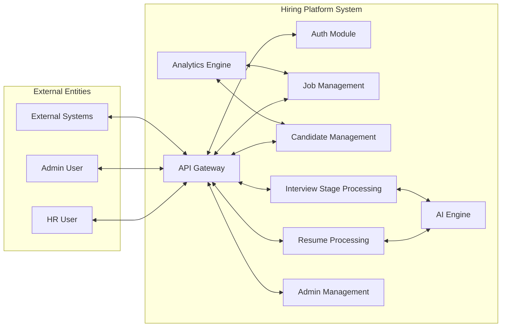
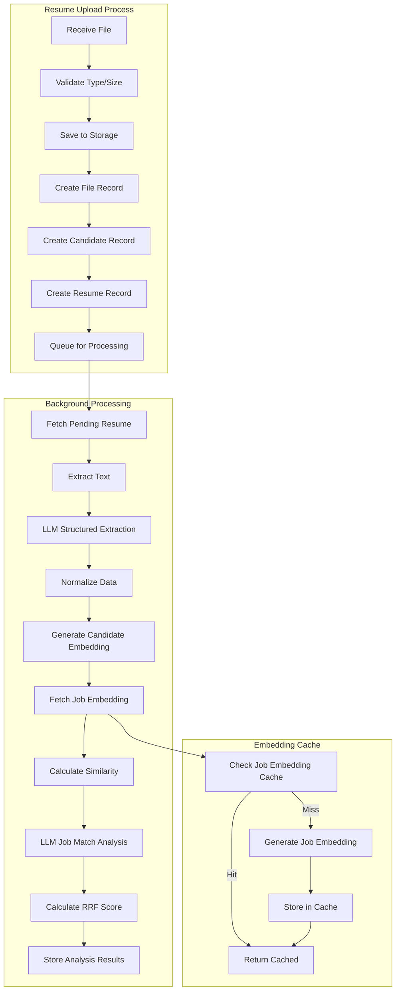
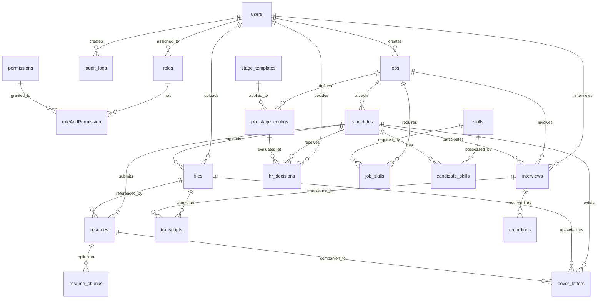
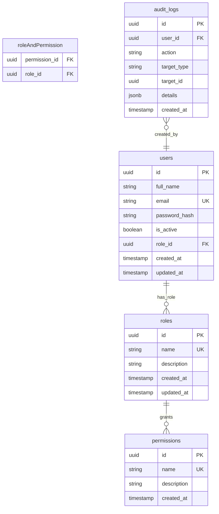
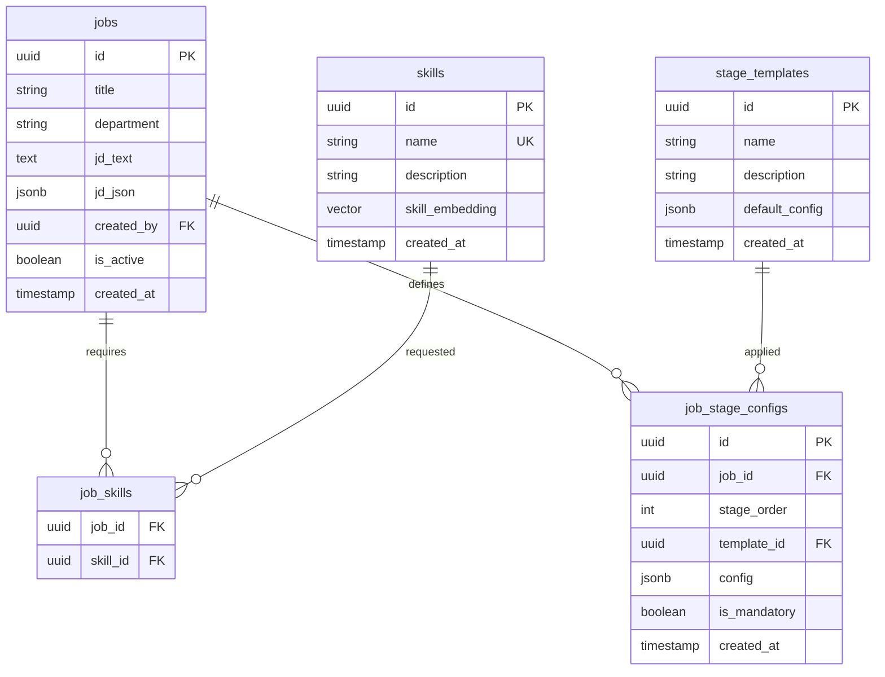
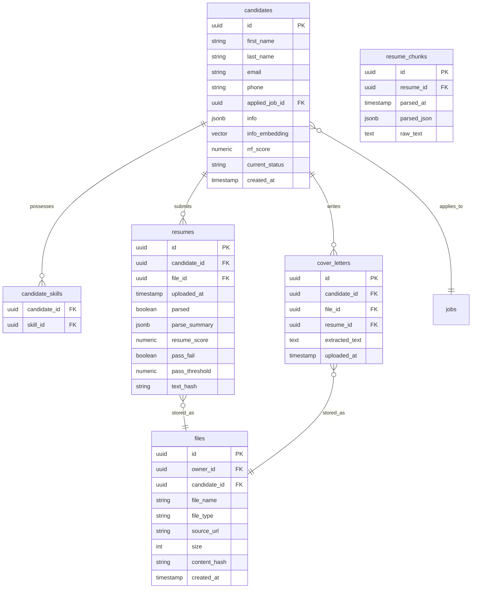
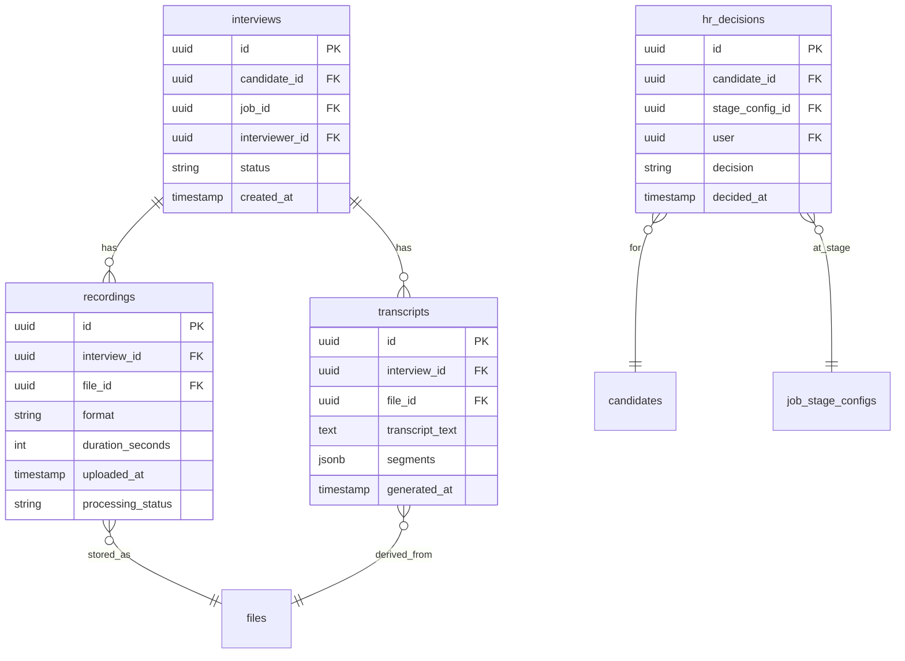

# Data Architecture

## Overview

The Hiring Platform uses PostgreSQL as its primary relational database with pgvector extension for vector similarity search. The data architecture is designed to support the complete hiring workflow from candidate application through final hiring decision.

```
┌─────────────────────────────────────────────────────────────────────────────┐
│                           DATA ARCHITECTURE LAYERS                           │
├─────────────────────────────────────────────────────────────────────────────┤
│                                                                              │
│  ┌─────────────────────────────────────────────────────────────────────┐   │
│  │                        PRESENTATION LAYER                              │   │
│  │                                                                      │   │
│  │   React Frontend ◄──────► REST API ◄──────► Pydantic Schemas        │   │
│  │                                                                      │   │
│  └─────────────────────────────────────────────────────────────────────┘   │
│                                      │                                       │
│                                      ▼                                       │
│  ┌─────────────────────────────────────────────────────────────────────┐   │
│  │                        APPLICATION LAYER                             │   │
│  │                                                                      │   │
│  │   Services ◄──────────► Repositories ◄──────────► ORM (SQLAlchemy)   │   │
│  │                                                                      │   │
│  └─────────────────────────────────────────────────────────────────────┘   │
│                                      │                                       │
│                                      ▼                                       │
│  ┌─────────────────────────────────────────────────────────────────────┐   │
│  │                          DATA LAYER                                   │   │
│  │                                                                      │   │
│  │   ┌─────────────────┐  ┌─────────────────┐  ┌─────────────────┐   │   │
│  │   │   PostgreSQL    │  │    pgvector     │  │     Redis       │   │   │
│  │   │   Relational   │  │    Vector       │  │     Cache       │   │   │
│  │   │    Storage      │  │    Storage      │  │                 │   │   │
│  │   └─────────────────┘  └─────────────────┘  └─────────────────┘   │   │
│  │                                                                      │   │
│  └─────────────────────────────────────────────────────────────────────┘   │
│                                                                              │
└─────────────────────────────────────────────────────────────────────────────┘
```

---

## Data Flow Diagram (DFD)

### Level 0: Context Diagram



### Level 1: Main Processes

```mermaid
flowchart TB
    subgraph Auth_Flow["1. Authentication & Authorization"]
        AUTH_IN[Login Request] --> AUTH_V[Validate Credentials]
        AUTH_V --> AUTH_T[Generate JWT Token]
        AUTH_T --> AUTH_R[Return Token]
    end

    subgraph Job_Flow["2. Job Management"]
        JOB_IN[Create/Update Job] --> JOB_V[Validate Job Data]
        JOB_V --> JOB_S[Save Job to DB]
        JOB_S --> JOB_SK[Link Job Skills]
        JOB_SK --> JOB_ST[Configure Stages]
        JOB_ST --> JOB_OUT[Return Job Response]
    end

    subgraph Resume_Flow["3. Resume Processing"]
        RES_IN[Upload Resume] --> RES_V[Validate File]
        RES_V --> RES_P[Parse Document]
        RES_P --> RES_E[Extract Info (LLM)]
        RES_E --> RES_EM[Generate Embeddings]
        RES_EM --> RES_M[Match with Job]
        RES_M --> RES_S[Store Results]
        RES_S --> RES_OUT[Return Match Score]
    end

    subgraph Candidate_Flow["4. Candidate Management"]
        CAND_IN[Candidate Action] --> CAND_S[Update Candidate Status]
        CAND_S --> CAND_INT[Create Interview]
        CAND_INT --> CAND_DEC[Record HR Decision]
        CAND_DEC --> CAND_OUT[Return Response]
    end

    subgraph Stage_Flow["5. Interview Stage Processing"]
        STAGE_IN[Stage Recording] --> STAGE_UP[Upload Recording]
        STAGE_UP --> STAGE_TR[Generate Transcript]
        STAGE_TR --> STAGE_EV[AI Evaluation]
        STAGE_EV --> STAGE_SC[Store Scores]
        STAGE_SC --> STAGE_OUT[Return Evaluation]
    end

    subgraph Admin_Flow["6. Admin Operations"]
        ADMIN_IN[Admin Request] --> ADMIN_V[Check Permissions]
        ADMIN_V --> ADMIN_OP[Execute Operation]
        ADMIN_OP --> ADMIN_LOG[Log to Audit]
        ADMIN_LOG --> ADMIN_OUT[Return Response]
    end

    subgraph Analytics_Flow["7. Analytics"]
        DATA_IN[System Data] --> AGG[Aggregate Metrics]
        AGG --> REPORT[Generate Reports]
        REPORT --> ANAL_OUT[Return Analytics]
    end
```

### Level 2: Resume Processing Detail



### Data Flow Summary

```
┌─────────────────────────────────────────────────────────────────────────────┐
│                              DATA FLOW SUMMARY                               │
├─────────────────────────────────────────────────────────────────────────────┤
│                                                                              │
│  External Entities                    Process                                │
│  ───────────────                    ────────                                │
│                                                                              │
│  HR User ───────────┬───► Authentication ───────► JWT Token                 │
│                    │                                                         │
│  HR User ──────────┼───► Job Management ────────► Job Record                │
│                    │        │                                                 │
│                    │        ▼                                                 │
│                    └───► Resume Upload ────────► Candidate + Resume          │
│                         │       │                                          │
│                         │       ▼                                          │
│                         └───► AI Processing ───► Match Score + Analysis     │
│                                   │                                          │
│                                   ▼                                          │
│  Admin User ────────┼───► Stage Processing ────► Interview Evaluation         │
│                    │        │                                                 │
│                    │        ▼                                                 │
│                    └───► Admin Operations ──► Audit Log Entry               │
│                                                                              │
│  Data Stores                                                            │
│  ───────────                                                            │
│                                                                              │
│  Users ────► Stores user accounts and authentication data                  │
│  Jobs ─────► Stores job postings and requirements                          │
│  Candidates ──► Stores candidate information and status                    │
│  Resumes ────► Stores resume files and extracted data                     │
│  Skills ─────► Stores skill definitions and embeddings                     │
│  Stages ─────► Stores interview stage configurations                       │
│  Interviews ──► Stores interview records and evaluations                    │
│  Audit ──────► Stores all administrative action logs                        │
│                                                                              │
└─────────────────────────────────────────────────────────────────────────────┘
```

---

## Entity Relationship (ER) Diagram

### Complete ER Diagram



### Core Entity Schemas

#### User Management Entities



#### Job & Skill Entities



#### Candidate Entities



#### Interview Entities



---

## Database Schema Details

### Primary Tables

| Table | Description | Key Columns |
|-------|-------------|-------------|
| `users` | Platform users | id, email, password_hash, role_id |
| `roles` | User roles | id, name |
| `permissions` | System permissions | id, name, description |
| `roleAndPermission` | Role-permission mapping | role_id, permission_id |
| `jobs` | Job postings | id, title, jd_text, jd_json, created_by |
| `skills` | Skill definitions | id, name, skill_embedding |
| `job_skills` | Job-skill associations | job_id, skill_id |
| `candidates` | Job applicants | id, applied_job_id, info, info_embedding, rrf_score |
| `candidate_skills` | Candidate-skill associations | candidate_id, skill_id |
| `files` | Uploaded files | id, owner_id, candidate_id, file_name, content_hash |
| `resumes` | Resume records | id, candidate_id, file_id, parse_summary, resume_score |
| `cover_letters` | Cover letter records | id, candidate_id, file_id |
| `resume_chunks` | Parsed resume segments | id, resume_id, parsed_json, raw_text |
| `stage_templates` | Interview stage templates | id, name, default_config |
| `job_stage_configs` | Job stage configurations | id, job_id, template_id, stage_order |
| `interviews` | Interview records | id, candidate_id, job_id, interviewer_id, status |
| `recordings` | Interview recordings | id, interview_id, file_id, format |
| `transcripts` | Interview transcripts | id, interview_id, transcript_text, segments |
| `hr_decisions` | HR stage decisions | id, candidate_id, stage_config_id, decision |
| `audit_logs` | Action audit trail | id, user_id, action, target_type, details |

### Indexes

| Table | Index | Type | Purpose |
|-------|-------|------|---------|
| `users` | email | UNIQUE | Fast email lookup |
| `files` | content_hash | INDEX | Duplicate detection |
| `resumes` | text_hash | INDEX | Deduplication |
| `candidates` | applied_job_id | INDEX | Job candidate filtering |
| `jobs` | is_active | INDEX | Active job queries |
| `candidates` | rrf_score | INDEX | Ranking queries |
| `audit_logs` | user_id, created_at | COMPOSITE | User activity queries |
| `candidates` | info_embedding | VECTOR | Semantic similarity search |

### Vector Storage (pgvector)

The platform uses pgvector for semantic search capabilities:

```sql
-- Enable extension
CREATE EXTENSION IF NOT EXISTS vector;

-- Example: Candidate embeddings for semantic search
ALTER TABLE candidates 
ADD COLUMN info_embedding vector(384);

-- Example: Skill embeddings
ALTER TABLE skills 
ADD COLUMN skill_embedding vector(384);

-- Semantic similarity query
SELECT id, name, 
       1 - (info_embedding <=> $query_embedding) AS similarity
FROM candidates
ORDER BY info_embedding <=> $query_embedding
LIMIT 10;
```

---

## Data Relationships

### Primary Key Strategy

- **UUID7**: All primary keys use UUID7 for time-ordered uniqueness
- **Benefits**: Distributed ID generation, time-sortable, collision-free

### Foreign Key Relationships

```
┌─────────────────────────────────────────────────────────────────────────────┐
│                         FOREIGN KEY RELATIONSHIPS                            │
├─────────────────────────────────────────────────────────────────────────────┤
│                                                                              │
│  users ──────────────┬──► roles (many-to-one)                               │
│                      │                                                       │
│  users ─────────────┼──► audit_logs (one-to-many)                           │
│                      │                                                       │
│  jobs ───────────────┼──► users (many-to-one, created_by)                  │
│                      │                                                       │
│  jobs ───────────────┼──► candidates (one-to-many)                          │
│                      │                                                       │
│  jobs ───────────────┼──► job_skills (one-to-many)                         │
│                      │                                                       │
│  jobs ───────────────┼──► job_stage_configs (one-to-many)                   │
│                      │                                                       │
│  skills ─────────────┼──► job_skills (one-to-many)                         │
│                      │                                                       │
│  skills ─────────────┼──► candidate_skills (one-to-many)                  │
│                      │                                                       │
│  candidates ──────────┼──► jobs (many-to-one, applied_job_id)              │
│                      │                                                       │
│  candidates ──────────┼──► resumes (one-to-many)                            │
│                      │                                                       │
│  candidates ──────────┼──► files (one-to-many)                             │
│                      │                                                       │
│  candidates ──────────┼──► interviews (one-to-many)                         │
│                      │                                                       │
│  candidates ──────────┼──► hr_decisions (one-to-many)                      │
│                      │                                                       │
│  stage_templates ─────┼──► job_stage_configs (one-to-many)                  │
│                      │                                                       │
│  job_stage_configs ───┼──► hr_decisions (one-to-many)                      │
│                      │                                                       │
│  files ───────────────┼──► resumes (one-to-one)                            │
│                      │                                                       │
│  interviews ──────────┼──► recordings (one-to-many)                        │
│                      │                                                       │
│  interviews ──────────┼──► transcripts (one-to-many)                       │
│                      │                                                       │
└─────────────────────────────────────────────────────────────────────────────┘
```

### Cascade Rules

| Parent Table | Child Table | On Delete |
|--------------|-------------|-----------|
| users | audit_logs | CASCADE |
| users | jobs | CASCADE |
| users | files | CASCADE |
| users | interviews | CASCADE |
| jobs | candidates | CASCADE |
| jobs | job_skills | CASCADE |
| jobs | job_stage_configs | CASCADE |
| jobs | interviews | CASCADE |
| skills | job_skills | CASCADE |
| skills | candidate_skills | CASCADE |
| candidates | candidate_skills | CASCADE |
| candidates | resumes | CASCADE |
| candidates | files | CASCADE |
| candidates | interviews | CASCADE |
| candidates | hr_decisions | CASCADE |
| candidates | cover_letters | CASCADE |
| files | resumes | SET NULL |
| files | cover_letters | SET NULL |
| files | transcripts | SET NULL |
| resumes | resume_chunks | CASCADE |
| resumes | cover_letters | SET NULL |
| interviews | recordings | CASCADE |
| interviews | transcripts | CASCADE |
| stage_templates | job_stage_configs | RESTRICT |
| job_stage_configs | hr_decisions | RESTRICT |
| roles | users | RESTRICT |

---

## Data Storage Architecture

### Storage Tiers

```
┌─────────────────────────────────────────────────────────────────────────────┐
│                            STORAGE TIERS                                     │
├─────────────────────────────────────────────────────────────────────────────┤
│                                                                              │
│  ┌─────────────────────────────────────────────────────────────────────┐   │
│  │                        HOT STORAGE (Redis)                            │   │
│  │                                                                      │   │
│  │  • Session data                                                      │   │
│  │  • Job embeddings cache                                              │   │
│  │  • Processing queue status                                           │   │
│  │  • Temporary tokens                                                   │   │
│  │                                                                      │   │
│  │  TTL: 1 hour - 24 hours                                             │   │
│  └─────────────────────────────────────────────────────────────────────┘   │
│                                                                              │
│  ┌─────────────────────────────────────────────────────────────────────┐   │
│  │                       WARM STORAGE (PostgreSQL)                      │   │
│  │                                                                      │   │
│  │  • User accounts                                                      │   │
│  │  • Jobs and candidates                                                │   │
│  │  • Interview records                                                 │   │
│  │  • Audit logs                                                         │   │
│  │                                                                      │   │
│  │  Retention: Indefinite                                               │   │
│  └─────────────────────────────────────────────────────────────────────┘   │
│                                                                              │
│  ┌─────────────────────────────────────────────────────────────────────┐   │
│  │                       COLD STORAGE (File System)                     │   │
│  │                                                                      │   │
│  │  • Resume files (PDF/DOCX)                                           │   │
│  │  • Cover letters                                                     │   │
│  │  • Interview recordings                                              │   │
│  │  • Transcripts                                                       │   │
│  │                                                                      │   │
│  │  Retention: Job duration + 1 year                                   │   │
│  └─────────────────────────────────────────────────────────────────────┘   │
│                                                                              │
└─────────────────────────────────────────────────────────────────────────────┘
```

### File Storage Structure

```
uploads/
├── resumes/
│   ├── {year}/
│   │   ├── {month}/
│   │   │   ├── {uuid}.pdf
│   │   │   └── {uuid}.docx
├── cover_letters/
│   ├── {year}/
│   │   ├── {month}/
│   │   │   └── {uuid}.pdf
├── recordings/
│   ├── {interview_id}/
│   │   ├── {uuid}.mp3
│   │   └── {uuid}.mp4
└── transcripts/
    └── {interview_id}/
        └── {uuid}.json
```

---

## Data Access Patterns

### Common Queries

#### Find Candidates by Job with Ranking

```sql
SELECT c.*, 
       r.resume_score,
       c.rrf_score,
       c.current_status
FROM candidates c
LEFT JOIN resumes r ON r.candidate_id = c.id
WHERE c.applied_job_id = $job_id
ORDER BY c.rrf_score DESC, c.created_at DESC
LIMIT 50;
```

#### Semantic Candidate Search

```sql
SELECT c.id, c.first_name, c.last_name,
       1 - (c.info_embedding <=> $query_embedding) AS similarity
FROM candidates c
WHERE c.applied_job_id = $job_id
  AND c.current_status = 'active'
ORDER BY c.info_embedding <=> $query_embedding
LIMIT 20;
```

#### Job Pipeline Analytics

```sql
SELECT 
    j.title,
    COUNT(c.id) AS total_candidates,
    COUNT(CASE WHEN r.pass_fail = true THEN 1 END) AS passed_screening,
    COUNT(CASE WHEN c.current_status = 'hired' THEN 1 END) AS hired
FROM jobs j
LEFT JOIN candidates c ON c.applied_job_id = j.id
LEFT JOIN resumes r ON r.candidate_id = c.id
WHERE j.id = $job_id
GROUP BY j.id, j.title;
```

#### Interview Stage Progress

```sql
SELECT 
    s.name AS stage_name,
    COUNT(DISTINCT hd.candidate_id) AS decided,
    jsc.is_mandatory
FROM job_stage_configs jsc
JOIN stage_templates s ON s.id = jsc.template_id
LEFT JOIN hr_decisions hd ON hd.stage_config_id = jsc.id
WHERE jsc.job_id = $job_id
GROUP BY s.name, jsc.stage_order, jsc.is_mandatory
ORDER BY jsc.stage_order;
```

---

## Data Security

### Sensitive Data Handling

| Data Type | Storage | Encryption | Access Control |
|-----------|---------|------------|----------------|
| Passwords | BCrypt hash | At rest | System only |
| JWT Secrets | Environment | At rest | Backend only |
| PII (name, email) | PostgreSQL | Optional | RBAC |
| Resume Files | File system | Optional | RBAC |
| Interview Recordings | File system | Optional | Admin only |
| Audit Logs | PostgreSQL | At rest | Admin only |

### Data Validation

- **Input**: Pydantic V2 schemas validate all API inputs
- **Types**: UUID validation for all foreign keys
- **Constraints**: Database-level constraints for referential integrity
- **File Validation**: MIME type and size validation before storage
