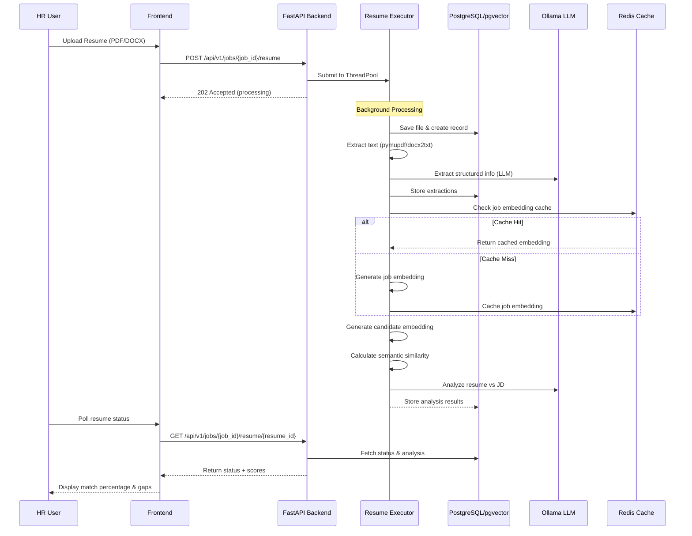
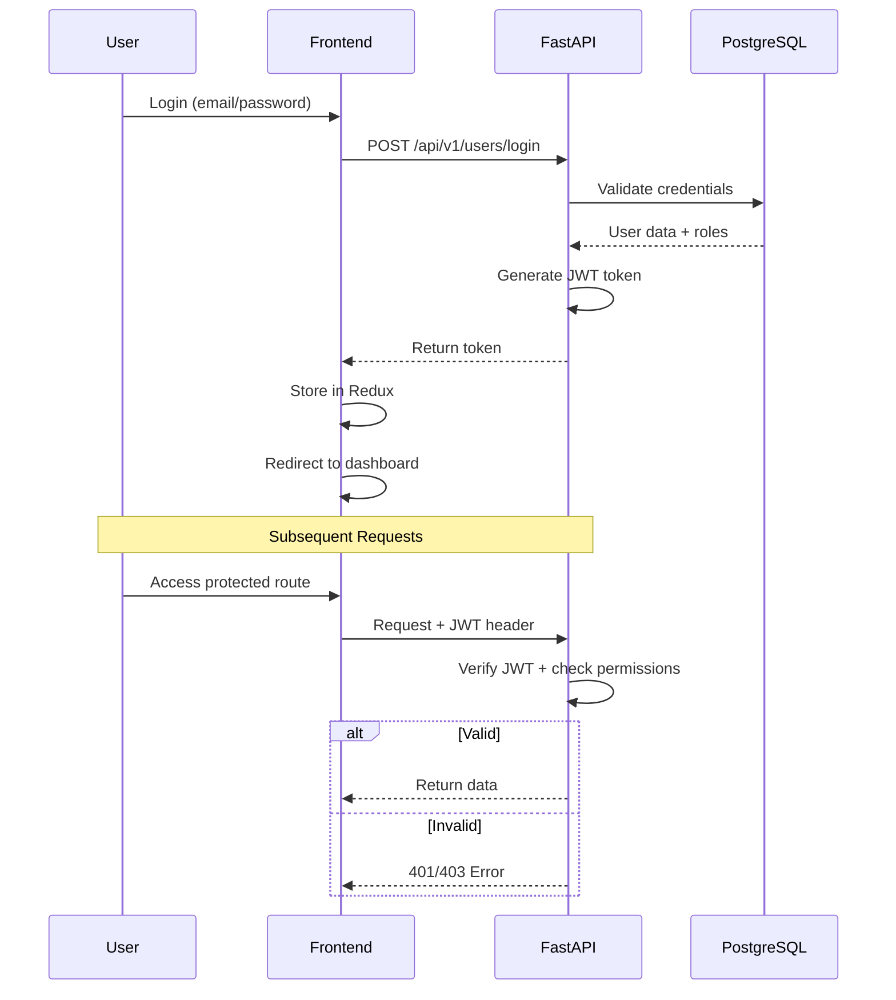
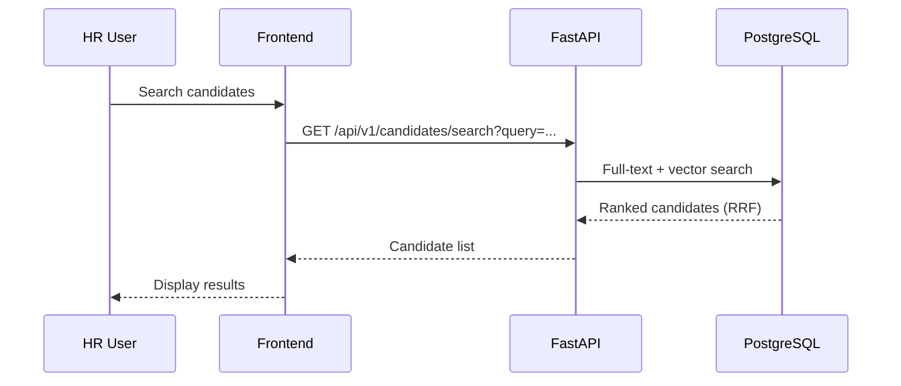
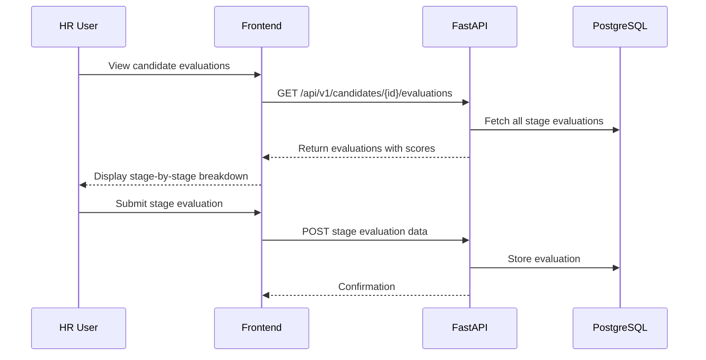
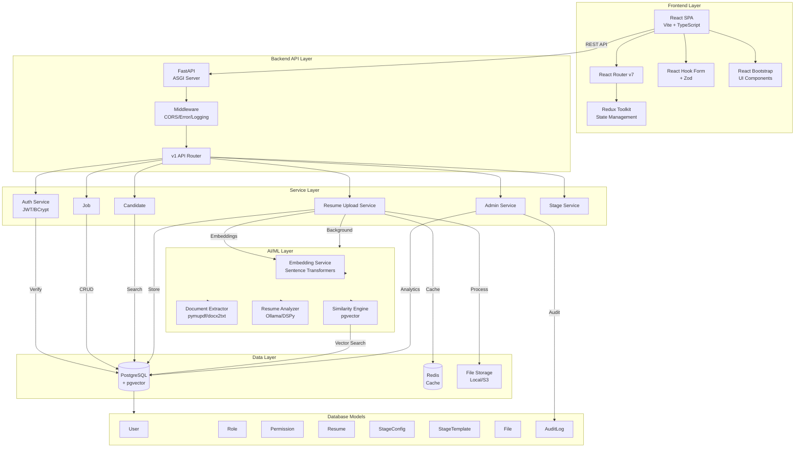
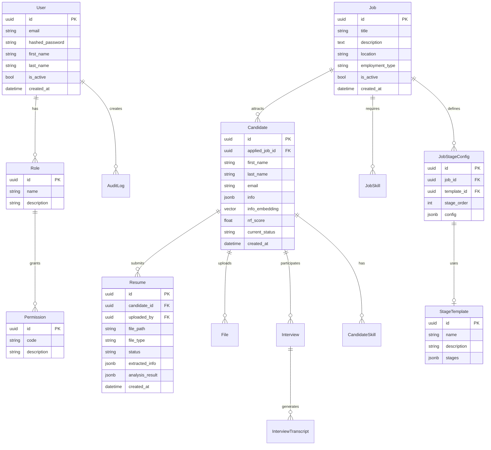
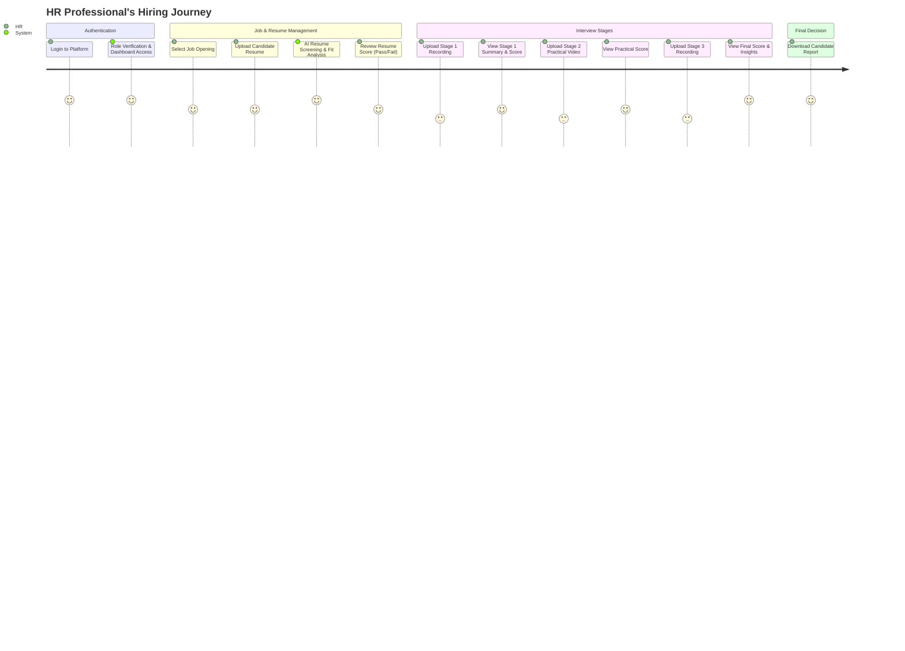

# Hiring Platform Architecture Documentation

## Overview

The Hiring Platform is a full-stack application for managing the candidate hiring workflow. It combines AI-powered resume screening with a multi-stage interview management system, enabling HR teams to efficiently evaluate, track, and hire candidates.

```
┌─────────────────────────────────────────────────────────────────────────┐
│                           HIRING PLATFORM                                 │
├─────────────────────────────────────────────────────────────────────────┤
│                                                                         │
│   ┌──────────────────────┐          ┌──────────────────────────────┐   │
│   │       FRONTEND        │          │          BACKEND             │   │
│   │   (React + Vite)      │◄────────►│    (FastAPI + SQLAlchemy)    │   │
│   │                       │  REST    │                              │   │
│   │   • Redux Toolkit     │   API    │   • Pydantic V2              │   │
│   │   • React Router v7   │          │   • PostgreSQL + pgvector    │   │
│   │   • React Bootstrap   │          │   • Redis Cache              │   │
│   │   • React Hook Form   │          │   • Ollama LLM Integration   │   │
│   └──────────────────────┘          └──────────────────────────────┘   │
│                                                                         │
└─────────────────────────────────────────────────────────────────────────┘
```

## Technology Stack

### Frontend
- **Framework**: React 19 (TypeScript) with Vite 8
- **State Management**: Redux Toolkit
- **Routing**: React Router v7
- **UI Components**: React Bootstrap 5.3
- **Forms**: React Hook Form + Zod validation
- **HTTP Client**: Axios

### Backend
- **Web Framework**: FastAPI (async Python 3.14+)
- **ORM**: SQLAlchemy + FastCRUD
- **Validation**: Pydantic V2
- **Database**: PostgreSQL with pgvector
- **Caching**: Redis
- **AI/NLP**:
  - DSPy for prompt optimization
  - Sentence Transformers (`all-MiniLM-L6-v2`) for embeddings
  - Ollama for LLM-based analysis
  - pymupdf/docx2txt for document parsing
- **Security**: BCrypt + JWT

---

## Functional Areas

### 1. Authentication & Authorization
```
┌─────────────────┐    ┌─────────────────┐    ┌─────────────────┐
│   Login Page    │───►│  Auth Service   │───►│  JWT Token      │
│   (Frontend)    │    │  (Backend)      │    │  Generation     │
└─────────────────┘    └─────────────────┘    └─────────────────┘
                              │
                              ▼
                       ┌─────────────────┐
                       │  RBAC System    │
                       │  Roles/Perms    │
                       └─────────────────┘
```

**Key Components**:
- `backend/app/v1/dependencies/auth.py` - JWT authentication
- `backend/app/v1/dependencies/permissions.py` - Permission checking
- `backend/app/v1/db/models/roleAndPermission.py` - Role/Permission models
- `frontend/src/store/slices/authSlice.ts` - Auth state management
- `frontend/src/components/auth/` - Protected/Public/Role routes

### 2. Resume Upload & AI Screening
```
┌─────────────────┐    ┌─────────────────┐    ┌─────────────────┐
│  File Upload    │───►│  File Storage   │───►│  Background     │
│  (Frontend)     │    │  (Disk/S3)     │    │  Processing     │
└─────────────────┘    └─────────────────┘    └─────────────────┘
                                                    │
                          ┌─────────────────────────┼─────────────────────────┐
                          ▼                         ▼                         ▼
                   ┌─────────────┐          ┌─────────────┐          ┌─────────────┐
                   │  Document    │          │  Resume     │          │  Semantic   │
                   │  Parser      │─────────►│  Extractor  │─────────►│  Embedding  │
                   │  (pymupdf)   │          │  (LLM)      │          │  Service    │
                   └─────────────┘          └─────────────┘          └─────────────┘
                                                                    │
                                                                    ▼
                                                            ┌─────────────┐
                                                            │  Job Match   │
                                                            │  Analyzer   │
                                                            │  (Ollama)   │
                                                            └─────────────┘
```

**Key Components**:
- `backend/app/v1/routes/resume_upload.py` - Upload endpoints
- `backend/app/v1/services/resume_upload/` - Upload service package
- `backend/app/v1/core/extractor.py` - Document parsing & LLM extraction
- `backend/app/v1/core/embeddings/service.py` - Semantic embedding generation
- `backend/app/v1/core/analyzer.py` - Resume vs JD analysis

### 3. Job & Candidate Management
```
┌─────────────────┐    ┌─────────────────┐    ┌─────────────────┐
│  Admin Jobs    │───►│  Job Service    │───►│  PostgreSQL     │
│  Dashboard      │    │                 │    │  (Jobs/Cands)   │
└─────────────────┘    └─────────────────┘    └─────────────────┘
                              │
                              ▼
                       ┌─────────────────┐
                       │  Candidate      │
                       │  Repository     │
                       └─────────────────┘
```

**Key Components**:
- `backend/app/v1/routes/jobs.py` - Job CRUD endpoints
- `backend/app/v1/routes/candidates.py` - Candidate search/retrieval
- `backend/app/v1/services/job_service.py` - Job business logic
- `backend/app/v1/repository/candidate_repository.py` - Candidate data access
- `backend/app/v1/db/models/jobs.py` - Job ORM model
- `backend/app/v1/db/models/candidates.py` - Candidate ORM model (with pgvector)

### 4. Interview Stages Pipeline
```
┌─────────────────┐    ┌─────────────────┐    ┌─────────────────┐
│  Stage Config   │───►│  Stage Service  │───►│  Interview      │
│  (Templates)    │    │                 │    │  Evaluations    │
└─────────────────┘    └─────────────────┘    └─────────────────┘
                              │
          ┌───────────────────┼───────────────────┐
          ▼                   ▼                   ▼
   ┌─────────────┐    ┌─────────────┐    ┌─────────────┐
   │  Stage 1     │    │  Stage 2     │    │  Stage N     │
   │  HR Round    │    │  Technical   │    │  Panel       │
   └─────────────┘    └─────────────┘    └─────────────┘
```

**Key Components**:
- `backend/app/v1/routes/admin.py` - Stage template management
- `backend/app/v1/services/stage_service.py` - Stage business logic
- `backend/app/v1/db/models/job_stage_configs.py` - Stage configuration
- `backend/app/v1/db/models/stage_templates.py` - Stage templates
- `frontend/src/components/candidate/Stage1HRRound.tsx` - HR evaluation UI

### 5. Admin & Analytics
```
┌─────────────────┐    ┌─────────────────┐    ┌─────────────────┐
│  Admin Panel    │───►│  Admin Service  │───►│  Analytics      │
│  (Frontend)     │    │                 │    │  Engine         │
└─────────────────┘    └─────────────────┘    └─────────────────┘
                              │
          ┌───────────────────┼───────────────────┐
          ▼                   ▼                   ▼
   ┌─────────────┐    ┌─────────────┐    ┌─────────────┐
   │  User Mgmt   │    │  Role Mgmt  │    │  Audit Logs  │
   └─────────────┘    └─────────────┘    └─────────────┘
```

**Key Components**:
- `backend/app/v1/services/admin_service.py` - Admin operations
- `backend/app/v1/services/admin/` - Sub-admin services
- `backend/app/v1/repository/admin_repository.py` - Admin data access
- `frontend/src/pages/Admin/` - Admin dashboard pages
- `frontend/src/apis/admin/` - Admin API client

---

## Key Execution Flows

### 1. Resume Upload & AI Screening Flow


### 2. Authentication Flow


### 3. Candidate Search Flow


### 4. Interview Stage Evaluation Flow


---

## System Architecture Diagram



---

## Database Schema Overview



---

## API Endpoints Summary

### Authentication (`/api/v1/users`)
| Method | Endpoint | Description |
|--------|----------|-------------|
| POST | `/login` | User login |
| POST | `/register` | User registration |
| GET | `/me` | Get current user |

### Resume Upload (`/api/v1/jobs/{job_id}`)
| Method | Endpoint | Description |
|--------|----------|-------------|
| POST | `/resume` | Upload resume for job |
| GET | `/candidates` | List job candidates |
| GET | `/resume/{resume_id}` | Get resume status |

### Candidates (`/api/v1/candidates`)
| Method | Endpoint | Description |
|--------|----------|-------------|
| GET | `/search` | Search candidates |
| GET | `/jobs/{job_id}` | Get job candidates |
| GET | `/{candidate_id}/evaluations` | Get evaluations |

### Jobs (`/api/v1/jobs`)
| Method | Endpoint | Description |
|--------|----------|-------------|
| GET | `/` | List jobs |
| GET | `/{job_id}` | Get job details |
| POST | `/` | Create job |
| PATCH | `/{job_id}` | Update job |

### Admin (`/api/v1/admin`)
| Method | Endpoint | Description |
|--------|----------|-------------|
| GET | `/users` | List all users |
| POST | `/users` | Create user |
| GET | `/roles` | List roles |
| POST | `/roles` | Create role |
| GET | `/permissions` | List permissions |
| GET | `/audit-logs` | View audit logs |
| GET | `/analytics` | Get analytics summary |
| GET | `/hiring-report` | Get hiring report |
| GET | `/stage-templates` | List stage templates |

---

## Infrastructure

```
┌─────────────────────────────────────────────────────────────────┐
│                        Infrastructure                            │
├─────────────────────────────────────────────────────────────────┤
│                                                                  │
│   ┌─────────────┐      ┌─────────────┐      ┌─────────────┐    │
│   │   Nginx     │─────►│   FastAPI    │─────►│  PostgreSQL │    │
│   │   (Proxy)   │      │   Backend   │      │  + pgvector │    │
│   └─────────────┘      └──────┬──────┘      └─────────────┘    │
│                               │                                    │
│                               ▼                                    │
│                        ┌─────────────┐      ┌─────────────┐    │
│                        │   Redis     │      │   Ollama    │    │
│                        │   Cache     │      │   (LLM)     │    │
│                        └─────────────┘      └─────────────┘    │
│                                                                  │
└─────────────────────────────────────────────────────────────────┘
```

---

## Security

- **Authentication**: JWT tokens with expiration
- **Password Hashing**: BCrypt
- **Authorization**: Role-Based Access Control (RBAC)
- **Permissions**: Granular permission system (e.g., `users:read`, `jobs:manage`)
- **Input Validation**: Pydantic models for all API inputs
- **CORS**: Configured allowed origins
- **Audit Logging**: All admin actions are logged

---

## Application Workflow

The platform operates on a structured, multi-stage workflow powered by a modern backend API and a responsive React frontend.

1. **Authentication & Authorization**: Users log in via the React frontend. The FastAPI backend authenticates them using JWT and assigns roles (Admin, HR Manager, Recruiter). Protected routing ensures users only access permitted areas.
2. **Job & Candidate Management**: Authorized users can view, create, or manage job postings using the dashboard. FastCRUD handles these database operations efficiently on the backend.
3. **Resume Upload & AI Pre-Filter**:
   - HR uploads candidate resumes (PDF/DOCX).
   - The frontend sends the file to the backend (`resume_upload` endpoints).
   - The backend parses the resume extracting text (using `pymupdf` or `docx2txt`), generates semantic embeddings utilizing Sentence Transformers, and stores them in PostgreSQL via pgvector.
   - The AI matches the resume against the Job Description (JD) and returns a Pass/Fail status along with skill gap analysis.
4. **Interview Stages Processing**: As candidates progress through additional interview stages (HR Screening, Technical Practical, Panel Evaluation), their audio/video recordings are uploaded.
5. **AI Evaluation**: The backend's AI components transcribe the media, apply LLM-as-a-Judge criteria (via DSPy for prompt optimization), and return evaluated technical and behavioral scores.
6. **Result Visualization & Analytics**: Evaluated results, match percentages, strengths, weaknesses, and comprehensive audit logs are aggregated and visualized on the administrative dashboard via sortable Data Tables.

### User Journey Diagram


