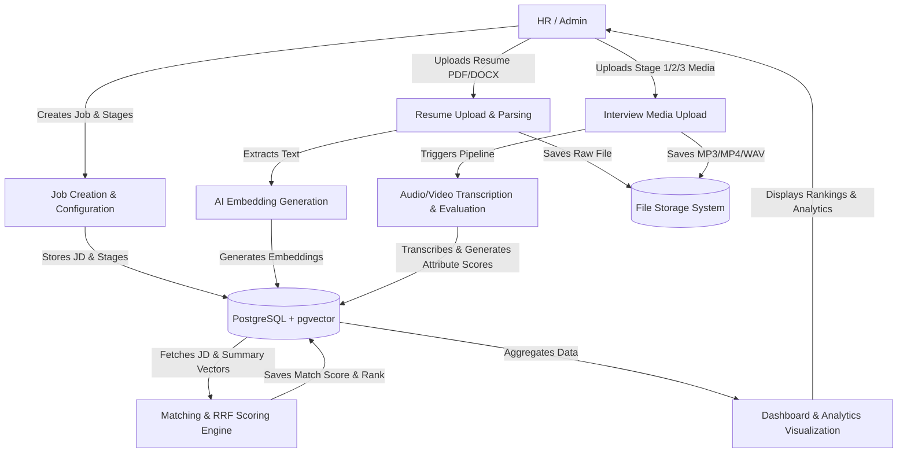
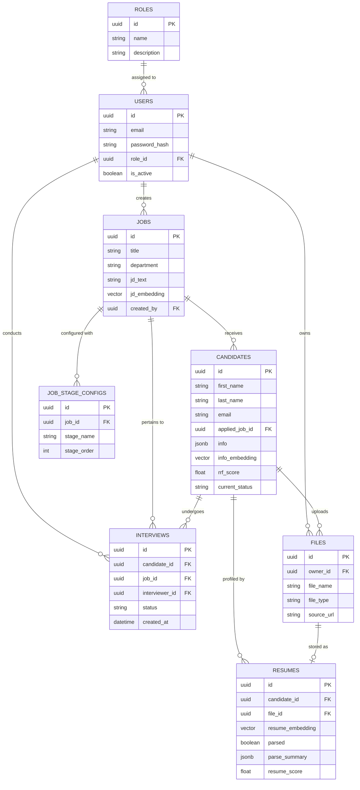

## Data Architecture

The data architecture of the Hiring Platform is built around PostgreSQL utilizing `pgvector` for efficient similarity searches and AI-driven candidate ranking. The schema is normalized to manage users, jobs, candidate profiles, standard resumes, unstructured file uploads, and stage configurations efficiently.

### Data Flow Diagram (DFD)

The following diagram illustrates how data moves through the system from initial job creation to final result visualization.

### Entity Relationship (ER) Diagram

The system's normalized schema includes the following primary entities and their relationships. 

